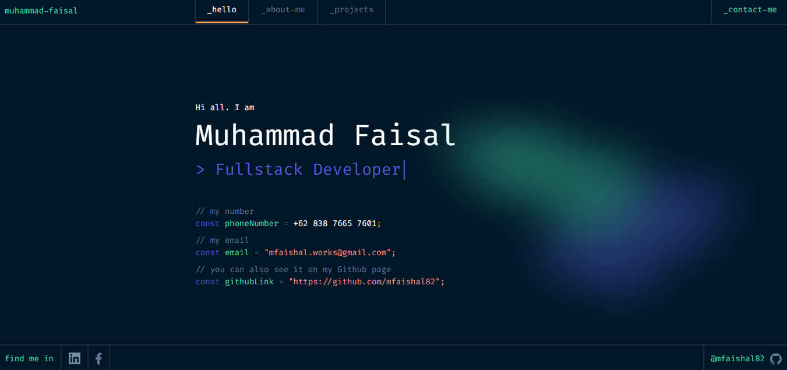

# next-portfolio


This is a [Next.js](https://nextjs.org) project bootstrapped with [`create-next-app`](https://github.com/vercel/next.js/tree/canary/packages/create-next-app).

## Getting Started

First, run the development server:

```bash
npm run dev
# or
yarn dev
# or
pnpm dev
# or
bun dev
```

Open [http://localhost:3000](http://localhost:3000) with your browser to see the result.

You can start editing the page by modifying `app/page.js`. The page auto-updates as you edit the file.

This project uses [`next/font`](https://nextjs.org/docs/app/building-your-application/optimizing/fonts) to automatically optimize and load [Geist](https://vercel.com/font), a new font family for Vercel.

## UI/ UX Source
Thank for UI/UX design from : { <br />
    - <a href="https://www.figma.com/design/rWsVc7sPOGR0vKRXjDbYdR/Portfolio-for-Developers-Concept-V.2-(Community)?node-id=64-2070&t=Ytd1CI1FsAAihJ5d-0"> Figma Portfolio for Developers Concept V.2 (Community) </a> <br />
    - <a href="https://www.behance.net/gallery/173956831/Portfolio?tracking_source=search_projects|web+developer+portfolio&l=0"> Portfolio
    Davide Simone </a> <br />
}

</img>